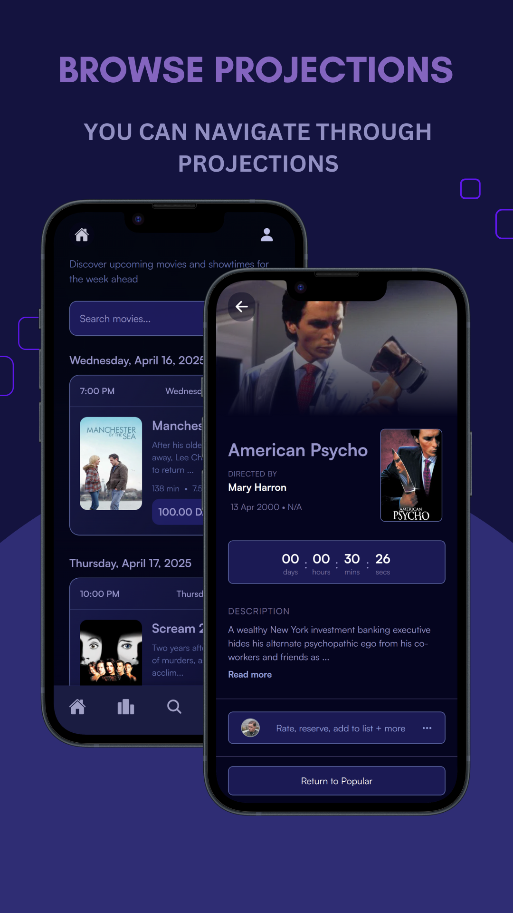
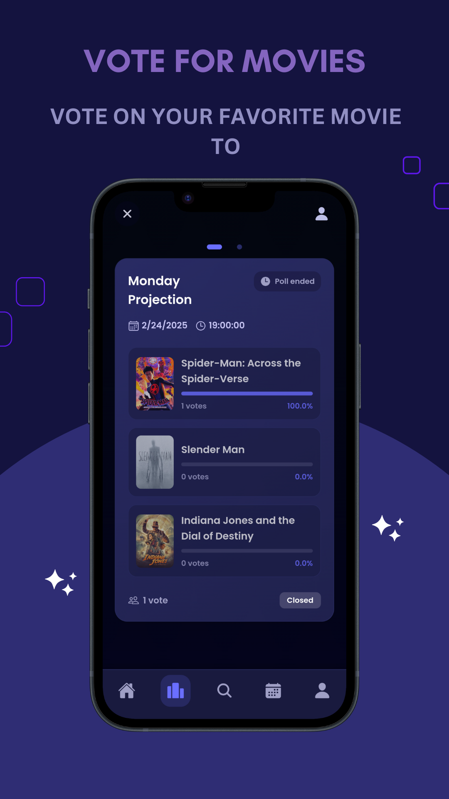

# 🎬 Cinematik

**Cinematik** is a sleek mobile ticket booking app built using **React Native**, **Zustand**, and **Supabase**. It allows users to effortlessly browse movies, book tickets, and manage reservations — all in real-time. With its responsive design and intuitive flow, Cinematik makes planning your movie night easier than ever.

---

<p align="center">       </p>

---

## 🚀 Features

- 🔍 **Movie Listings**  
  Explore a curated list of current and upcoming movies with detailed information like title, genre, ratings, and showtimes.

- 🔐 **User Authentication**  
  Login and register securely with **Supabase Auth**, ensuring safe handling of user credentials.

- 🔄 **Real-Time Projections**  
  Get instant updates on projections and bookings using Supabase’s powerful real-time features.

- 🎟️ **Seamless Ticket Booking**  
  Book tickets in just a few taps, view booking status, and manage reservations directly from the app.

- ⚛️ **Zustand for State Management**  
  Lightweight, scalable state management using Zustand for a super smooth and snappy experience.

---

## 🛠️ Tech Stack

- [React Native](https://reactnative.dev/) — cross-platform mobile app framework
- [Zustand](https://github.com/pmndrs/zustand) — fast and minimal state management
- [Supabase](https://supabase.io/) — backend as a service (auth, database, real-time)
- [Expo](https://expo.dev/) — (optional) used for streamlined development & deployment

---

## 📦 Getting Started

### 1. Clone the Repository

```bash
git clone https://github.com/MoncefDrew/cinematic.git
cd cinematic


This command will move the starter code to the **app-example** directory and create a blank **app** directory where you can start developing.

## Learn more

To learn more about developing your project with Expo, look at the following resources:

- [Expo documentation](https://docs.expo.dev/): Learn fundamentals, or go into advanced topics with our [guides](https://docs.expo.dev/guides).
- [Learn Expo tutorial](https://docs.expo.dev/tutorial/introduction/): Follow a step-by-step tutorial where you'll create a project that runs on Android, iOS, and the web.

## Join the community

Join our community of developers creating universal apps.

- [Expo on GitHub](https://github.com/expo/expo): View our open source platform and contribute.
- [Discord community](https://chat.expo.dev): Chat with Expo users and ask questions.
